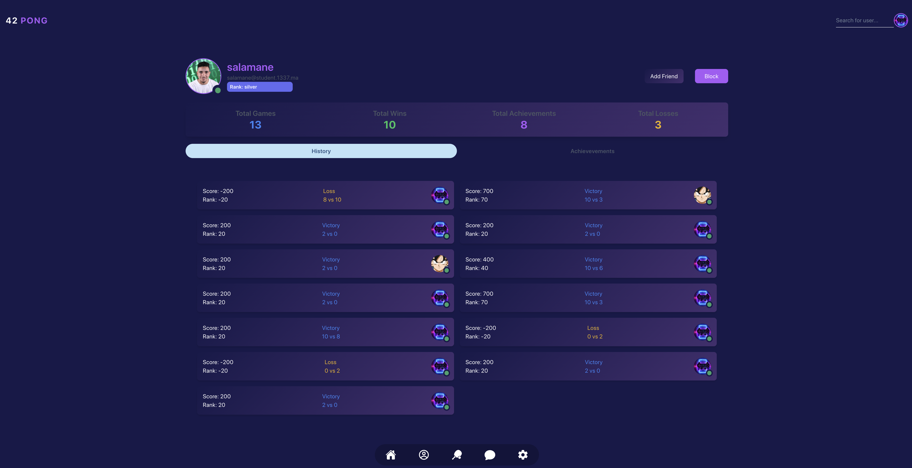
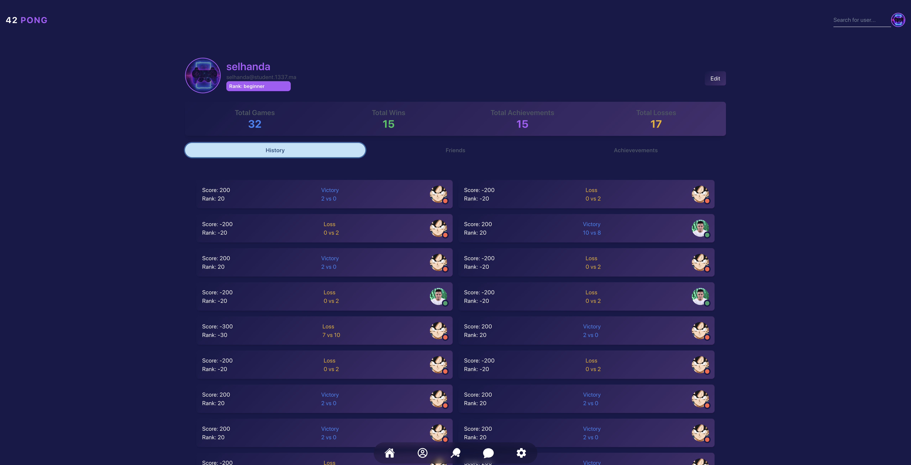
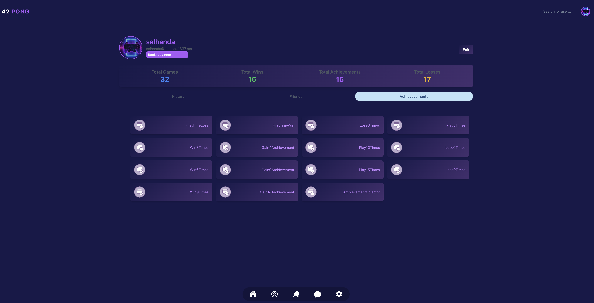
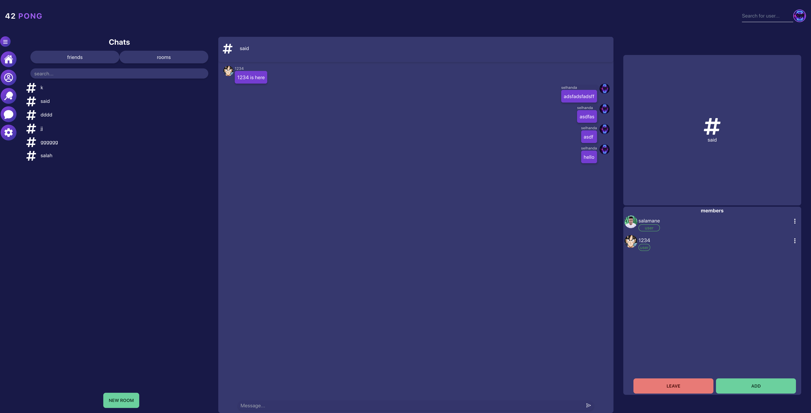
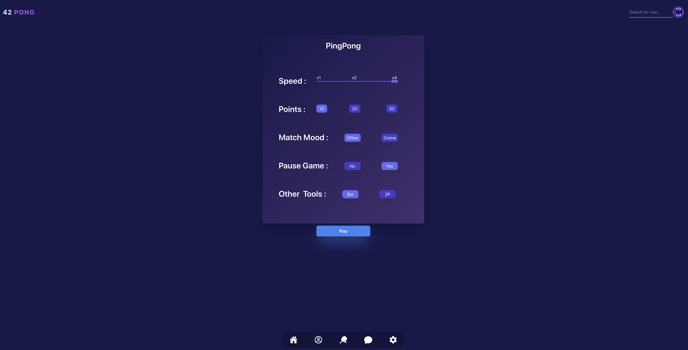
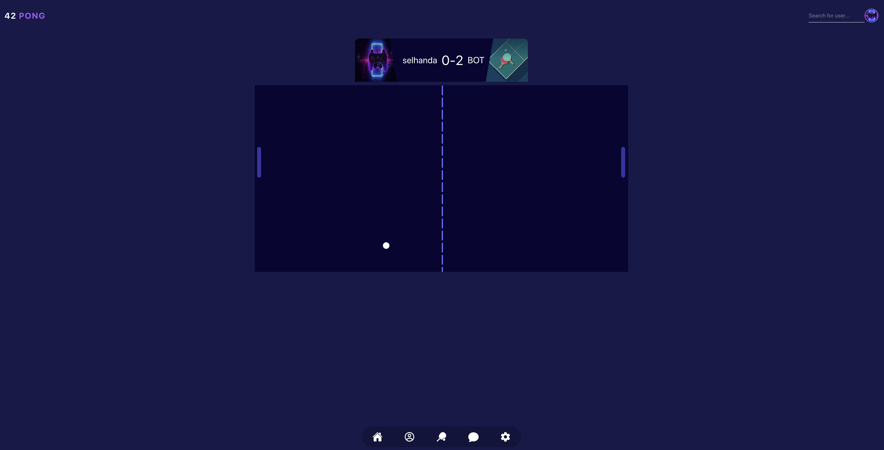
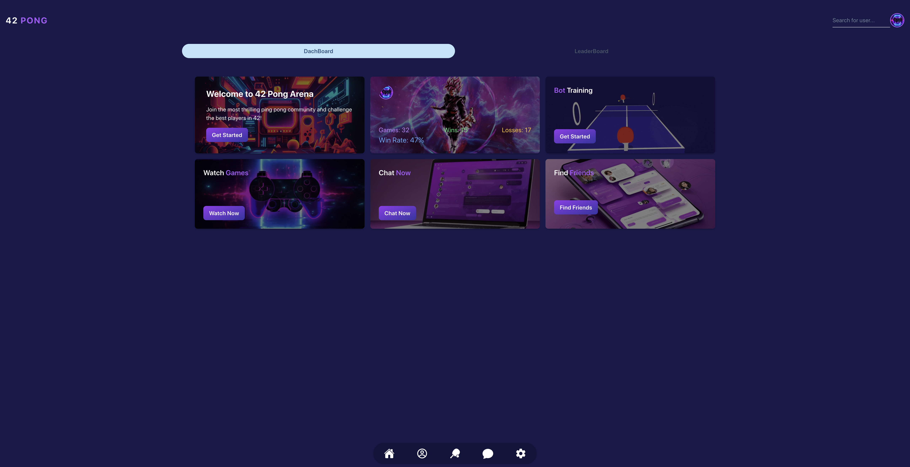
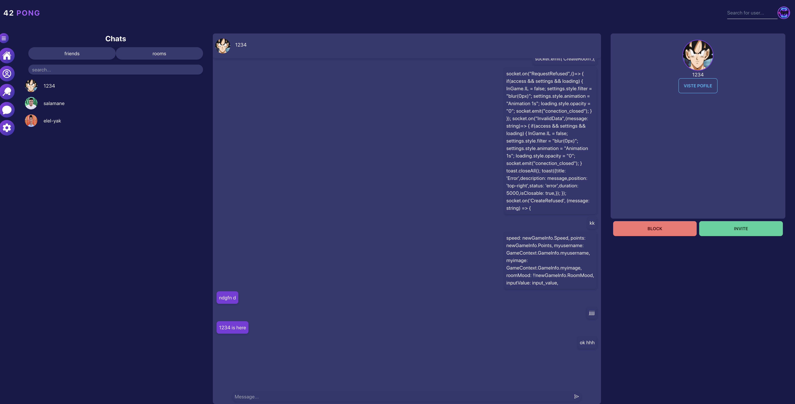

# ft_transcendence is Online Multiplayer Ping Pong Game

       


## Overview

This project is an online multiplayer ping pong game that was developed by a collaborative team effort. The game boasts features such as a chat system, player profiles, and a friends list. It was built using Docker for containerization, Next.js for the frontend, and Nest.js for the backend.

## Features

- **Multiplayer Gameplay**: Engage in exciting ping pong matches with players from around the world.

- **Chat System**: Communicate with other players in real-time through an integrated chat system.

- **Player Profiles**: Create and customize your player profile to showcase your achievements and progress.

- **Friends List**: Connect with friends and challenge them to friendly matches.

## Technologies Used

- **Frontend**: Next.js was employed for the frontend development, ensuring a seamless and responsive user experience.

- **Backend**: The backend was built using Nest.js, providing a robust and scalable server framework.

- **Containerization**: Docker was utilized for containerization, enabling consistent deployment across various environments.

## Contributions

As a team member, I played a pivotal role in the development process. My contributions included:

- **Game Functionality**: Focused on developing the core game mechanics, including ball physics, player movement, and scoring.

- **User Interface Design**: Actively participated in the design of the user interface, ensuring an intuitive and engaging player experience.

- **Debugging and Testing**: Assisted in identifying and resolving bugs, as well as contributing to comprehensive testing efforts.

## Installation

1. Clone the repository:

```bash
git clone https://github.com/your_username/online-ping-pong.git
cd online-ping-pong
